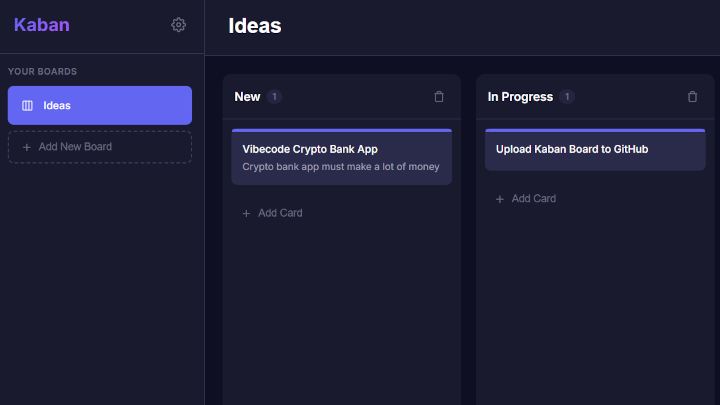

# KabanBoard


A modern Kaban board application built with **Vue 3** and **MongoDB**.

## Features

- 📋 Create multiple boards
- 📝 Add, edit, and delete cards
- 🎨 Color-coded cards
- 🖱️ Drag and drop cards between columns
- 🌙 Modern dark theme
- 💾 Data persistence with MongoDB



## Tech Stack

- **Frontend**: Vue 3, Vite, Vue Router
- **Backend**: Node.js, Express
- **Database**: MongoDB

## Prerequisites

- Node.js 18+
- MongoDB (local or Atlas)

## Quick Start

### 1. Start MongoDB
```bash
mongod
```

### 2. Start Backend
```bash
cd server
npm install
npm start
```

### 3. Start Frontend
```bash
cd client
npm install
npm run dev
```

### 4. Open in Browser
Navigate to `http://localhost:5173`

## Default Columns

New boards automatically include three columns:
- **New** - For new tasks
- **In Progress** - For tasks being worked on
- **Done** - For completed tasks

## Docker

Run with Docker Compose:

```bash
docker-compose up -d
```

This pulls images from Docker Hub (`demensdeum/kaban-server`, `demensdeum/kaban-client`) and starts the full stack.

Access at: **http://localhost**

See [DOCKER.md](DOCKER.md) for full documentation.

## License

MIT
